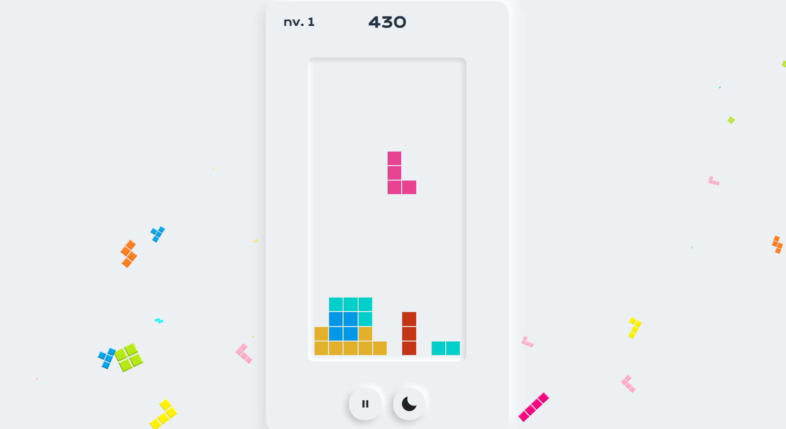

# Squaretrix

_Videojuego del clásico Tetris realizado en JavaScript_

## Link del proyecto 🚀

_[Squaretrix](https://squaretrix.netlify.app)_

## Instrucciones ⚙️

Tecla zquierda: Mover izquierda

Tecla derecha: Mover derecha

Tecla arriba: Rotar tetromino

Tecla abajo: Bajar tetromino más rápido

Tecla SPACE: Bajar tetromino instantáneo

## Autor ✒️

**Luis Correa** - *Desarrollo del videojuego* - [GitHub](https://github.com/luisCorreaCespedes)

## Expresiones de Gratitud 🎁

* Si les gusta el proyecto pongan su ⭐️
* Mini juego hecho para todos los que toman café ☕ al programar. 
* Gracias a todos mis amigos por apoyarme a crear videojuegos aunque sean simples 🤓.

